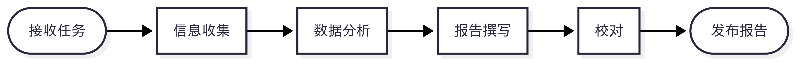
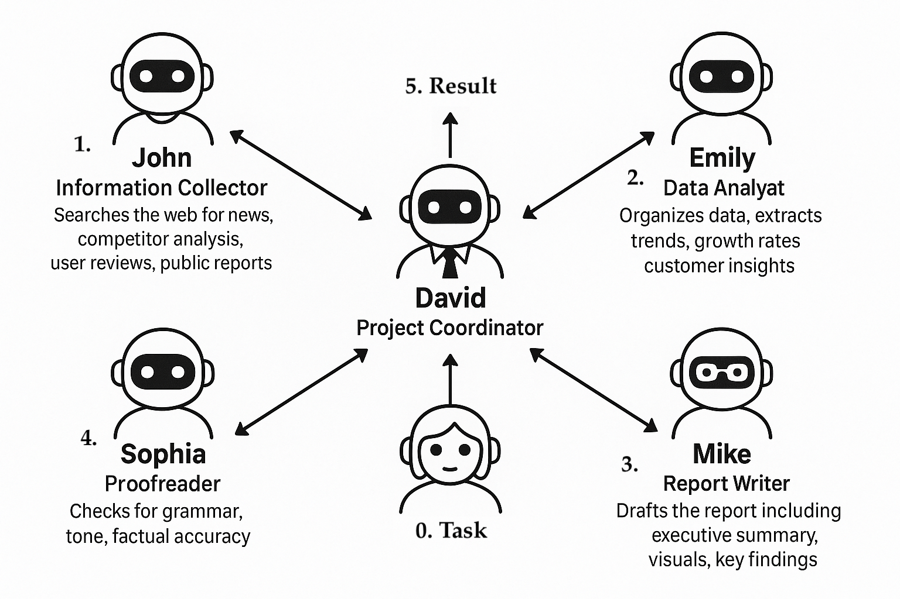

# 如何用多智能体实现团队工作

多智能体 AI 系统听起来可能很抽象
——但想象它们是一个现实世界的团队。每个成员承担专门的任务，协同合作完成共同目标。下面我们将通过一个示例进行类比，并将其映射到真实的 AI 智能体系统。


---

## 类比场景：完成市场调研报告  

你需要为下个季度准备一份行业趋势的市场调研报告（流程图如下）。

{ style="display: block; margin: auto; width: 600px;" }

传统的方式是你组建了一个团队，每位成员都有专注的角色。

---

## 团队角色与 AI 智能体的对应关系

| **姓名**  | **角色**             | **工作职责**                                                                   | 
|-----------|----------------------|--------------------------------------------------------------------------------|
| **John**  | 信息收集员           | 搜索网络新闻、竞争对手分析、用户评论、公开报告                                | 
| **Emily** | 数据分析师           | 整理数据，提取趋势、增长率与客户洞察                                         | 
| **Mike**  | 报告撰写人           | 撰写报告，包括执行摘要、图表和关键发现                                       | 
| **Sophia**| 校对员               | 检查语法、语气和事实准确性                                                   | 
| **David** | 项目协调员           | 统筹任务，整合结果，推动项目进展                                             | 


---

## 那为什么不能直接用一个提示词生成报告？

对于熟悉AI的人来说，当面对“撰写市场调研报告”这类需求时，第一反应往往会联想到提示词工程。是否可以通过设计一条超级提示词，将任务需求完整传达给DeepSeek或GPT-4这类大模型，从而直接生成符合要求的报告？

这个设想看似合理，但实际操作后往往会发现，模型生成的报告普遍存在可用性缺陷：内容空洞缺乏实质信息，逻辑跳跃，或是充斥着AI特有的空话套话。这些报告看似完整，实则经不起细细推敲。

问题根源并不在于模型本身的能力不足，而是通用大模型的角色定位决定了其产出水平始终介于普通用户和专家之间。它可以做 John 的工作，也能做 Emily 的工作，但无法同时整合五个专业岗位的工作成果，更何况保证这些内容的内在逻辑自洽。

更深层的问题在于，现实工作中的每个专业角色都具备独特的经验储备：对行业的认知、对报告结构的偏好、对客户需求的精准把握，这些通过长期实践积累的隐性知识，显然无法通过单条提示词完整传输给通用大模型。


---

## 所以，多智能体系统就显得特别重要了

既然我们做不了“一个人干五个人的活”，那还是选择“一个角色一个模型”更为靠谱。

相较于追求一个万能提示词，更好的方式是：
将复杂任务拆解为标准化流程，让不同AI智能体专注特定领域，比如让一个模型专门负责信息搜集，另一个模型根据结构生成内容，还有一个专门校对语言风格，最终由项目管理型AI进行系统整合。

听着复杂，可我们日常工作中，团队协作也一直是这么干的。正因任务复杂，我们才需要团队。而 AI 也一样，它不是一个人包打天下的工具，而是可以像团队成员一样，和其他 AI 搭配协作，完成更复杂、更真实的任务。


---

## 这才是真正有用的 AI 协作方式

通用 AI 给人的“万能感”让我们一度以为它能接管整个任务，但真的落地时，我们才发现：“不受控”、“缺少积累”、“无法打断”才是最大的问题。
多智能体的设计，反而回归了我们熟悉的协作方式：
分工明确、有责任边界、过程可控。

最重要的是，它允许你“插手”过程，能在中间修改 prompt、替换模型、评估效果，不用每次都把希望压在一次调用上。未来真正高效的 AI 系统，不是“一个聪明的大脑”，而是一群能互相配合的“小专家”。


---

# 我们如何让 AI 全自动完成这个团队协作？

接下来我们要停止“假设”，让真正 AI 模拟团队，从信息抓取到分析写作、再到校对发布，实现全流程自动化工作流，打造一套  **100% AI 自动化的工作流**。

---

## 从人到 AI：角色怎么映射成智能体？

首先回顾一下，我们的五个角色分别是谁以及他们分别负责的工作。

| 智能体名     | 对应人类角色   | 主要任务                    | 使用技术                        |
|--------------|----------------|-----------------------------|---------------------------------|
| A_John        | 信息员         | 搜索数据、抓取内容           | LangChain、API 包装器            |
| A_Emily       | 数据分析师     | 总结趋势、提炼洞察           | LLM + pandas + 图表生成工具     |
| A_Mike        | 内容撰写者     | 把分析内容转成结构化报告     | GPT/Claude 等结构化写作模型     |
| A_Sophia      | 校对者         | 检查内容逻辑、语法与准确性   | LLM 检查器、规则校验器           |
| A_David       | 协调者         | 管控流程、串联任务           | CrewAI、AutoGen、LangGraph 编排 |

这就像一个“虚拟团队”，每位成员都有清晰的分工和工具。更棒的是，他们不会加班，不会忘事，还能同步运行。

{ style="display: block; margin: auto; width: 600px;" }

---

## 这套系统怎么搭起来？

其实也不复杂，整个过程可以拆解为以下四步：

### 1️⃣ 定义任务流程图（就像画流程图一样）

我们首先定义一个“任务图”（Task Graph），告诉 AI 各步骤的先后顺序，例如：

```
collect_data → analyze_data → write_report → validate_report → finish
```

这个可以用 LangGraph、AutoGen、CrewAI 等框架来实现，它们就像 AI 世界里的“项目管理软件”。

---

### 2️⃣ 给每个智能体写一份“简历”+“工具箱”

每位智能体都有自己的**系统提示（System Prompt）**，告诉它“你是谁，你要干什么”。同时他们还拥有各自的“工具箱”，比如可以调用搜索引擎、运行 Python、生成 Markdown 等。

比如我们的分析师 Emily 的配置可能是这样的：

```python
system_prompt = "你是一名市场数据分析师。请根据原始输入数据提取行业趋势并总结关键信息，以 JSON 格式输出。"
tools = [pandas_executor, trend_detector]
```

---

### 3️⃣ 把流程连起来：David 上场

协调员 David 是“幕后大脑”。他会看着流程图按顺序触发任务，比如：

1. 先让 John 去抓数据  
2. 抓完后，把数据交给 Emily  
3. 然后再交给 Mike 撰写初稿  
4. 最后 Sophia 负责检查，确认无误再输出

数据可以通过共享内存或中间任务文件在智能体之间传递，整个过程就像接力赛一样，一环扣一环。

---

### 4️⃣ 一键运行，像团队一样协作

当所有智能体都配置好之后，整个流程就能自己跑起来了。

无需专人旁侧“指挥”——每个角色都清楚自身职责，会耐心等待前一环节完成后再无缝衔接上场。

John 抓数据，Emily 自动开始分析，Mike 写初稿，Sophia 接手校对。

整个过程就像一个高效的虚拟小组，无人打断、催促，也无人偷懒。
流程全程自动记录，出现问题可随时追溯核查，精准定位“谁做了什么”。若某环节输出质量欠佳，还可引入人工评估，像资深同事般精准指出问题并引导改进优化。


---

## 看起来简单，其实背后并不容易

归根结底，这种多智能体协作模式与人类惯常的工作方式不谋而合。我们早已习惯让“一个人管一个环节”，深知分工协作既能提升效率，又能使结果更可控。

将此模式引入 AI 领域后，效果往往是惊人的：每个智能体就像一个虚拟专家，专注于特定内容，高效、精准地完成任务。不同的智能体还能组合、重排，未来甚至可以随时增加一个“行业顾问”或“内容翻译员”加入工作流，而不会打乱已有结构。


---

## 但真正搭建起来，并不轻松

多智能体系统虽有诸多优势，但要将其实现并落地为一个完整的应用，仍面临诸多挑战。每个 “专家智能体” 都需设定清晰目标与明确的行为逻辑，同时要选择合适的模型并精心配置提示词，还要具备基本的调度与异常处理能力。

而最关键的是：**如果某些角色对质量要求较高，单靠通用大模型就很难满足**。比如，分析师智能体要真正读懂财务指标、判断行业变化趋势，这时候就不是“换个提示词”能解决的问题了。

这正是 **DeepExtension** 发挥作用的地方：它为那些希望“自己训练垂直模型”的专家用户，搭建了一个切实可行的落地平台。
你不需要懂 PyTorch、不需要搭基础设施，只需要把业务经验转化成数据和规则，系统就能帮你把一个“懂行的 AI 同事”训练出来，从而精准补全通用模型所难以覆盖的专业领域。


---

## 总结：对于复杂的专业性强的工作不是把一切交给一个大模型，而是构建一个智能体专家团队

这种分工协作的模式，相比依赖单一提示词碰运气，更贴近 “工程化 AI 应用”。你无需精通模型原理，只需像安排人员任务般合理配置智能体，就能构建出一个可控、可调且实用的智能工作流。

---

**你是不是也在想，自己的业务能不能也搭出一个 AI 团队？我们可以帮你从原型做起，让自动化协作从 PPT 变成现实。请联系我们。**