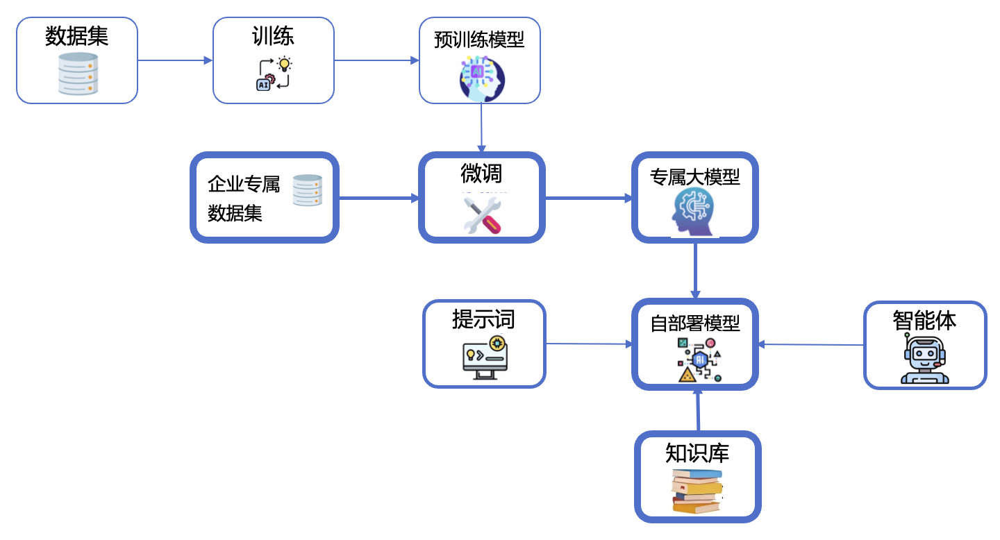

# How Fine-Tuning, RAG, and Agents Work Together in Enterprise AI Transformation

Digital transformation with AI is no longer just about adopting a chatbot or using AI for a specific task—it's about building a holistic, intelligent system tailored to your enterprise needs. 

---

In our companion post *[how-agents-work-as-team.md]*, we talked about how AI agents can function like a real team—each playing a role to solve complex tasks. If you’re building your first enterprise AI project, you've probably come across a few buzzwords already: pretrained LLMs, fine-tuning, RAG, **Knowledge Bases**, and AI agents.

It’s easy to treat them as separate technologies. But in reality, they’re pieces of the same puzzle. 
In this post, we’ll walk through the three key components—**fine-tuning**, **retrieval-augmented generation (RAG)**, and **AI agents**—and explain how they work together to empower enterprise-level intelligence until building intelligent, enterprise-ready AI systems.

---

{ style="display: block; margin: auto; width: 600px;" }

---

## Building on a Foundation: Pretrained Models and Your Data

Most AI projects today begin with a large language model (LLM) that has already been trained on massive public datasets. These models, like GPT or LLaMA, are surprisingly capable—but also very general. They're great at writing poems, summarizing articles, solving math problems, or translating between languages. But they still fall short when it comes to understanding the deeper, more nuanced aspects of your business—like how your experts think, how problems are solved based on years of experience, or the specific constraints and requirements that shape real decisions.

To make AI truly useful in a business setting, it needs to understand your world—your products, your terminology, your workflows, and your logic. That’s where your enterprise data—and your expertise—comes into play.

---

## Shaping the Model to Your Domain

Fine-tuning is how you take a general-purpose model and make it your own. You feed it examples from your company: documents, chat logs, reports, emails, manuals—whatever reflects your domain knowledge. Over time, the model learns to reflect your tone, your logic, and your way of working.

Once fine-tuned, the model becomes a specialist. It no longer gives generic answers—it starts to speak like someone from your company would. For enterprises in finance, manufacturing, logistics, or tech support, this step is essential to bridge the gap between general intelligence and domain expertise.

---

## Letting the Model Access What It Doesn’t Know

Even after fine-tuning, the world keeps changing. New policies get released, new products are launched, and your internal documentation grows every week.

Instead of constantly retraining the model, you can connect it to your own **Knowledge Base**—this is where **Retrieval-Augmented Generation**, or RAG, comes in. RAG allows the model to search through your up-to-date content and bring relevant pieces into the conversation, just like a well-prepared assistant would look something up before answering.

With RAG, your AI stays current, draws from verified knowledge, and gives answers backed by real content—rather than trying to “remember” everything.

---

## Turning Intelligence into Action with AI Agents

By this point, your model understands your business language and can tap into current, trusted knowledge. But knowing isn’t the same as doing. To transform intelligence into real outcomes, you need something that can reason, decide, and act—this is where **AI agents** come in.

Agents go far beyond traditional chatbots. They don’t just respond—they interpret intent, break down tasks, ask clarifying questions, consult your knowledge base, and trigger real actions, like generating a report or updating a system. If needed, they also know when to involve a human expert. In many ways, they reflect how your best employees operate: informed, adaptive, and outcome-focused.

What makes agents especially powerful is their ability to internalize not just static rules, but **how your organization solves problems**—the logic, the steps, the escalation paths, and even the trade-offs that only come with experience. They act as the coordination layer between models, data, and real workflows.

In a digital enterprise, agents can support your team with internal queries, assist customers with deep product understanding, automate reporting, monitor business processes, or guide complex decisions. You're no longer just automating tasks—you're **automating how your enterprise thinks and operates**.

---

## How It All Comes Together

Think of it this way:

- The **pretrained model** is your starting brain.
- **Fine-tuning** helps that brain understand your business.
- **RAG** connects it to live, trusted knowledge.
- **Agents** give it the ability to act.

Together, they create a self-adaptive system that can grow with your enterprise, improve over time, and operate in a secure, controllable environment—especially when deployed on-premise.

---

## Final Thoughts

The promise of AI in the enterprise isn’t just about faster answers or flashier interfaces. It’s about building a system that learns your domain, adapts in real-time, and works alongside your people. With fine-tuning, RAG, and agents working together, you move from static tools to **living systems**—ones that think, learn, and act in sync with your goals.

