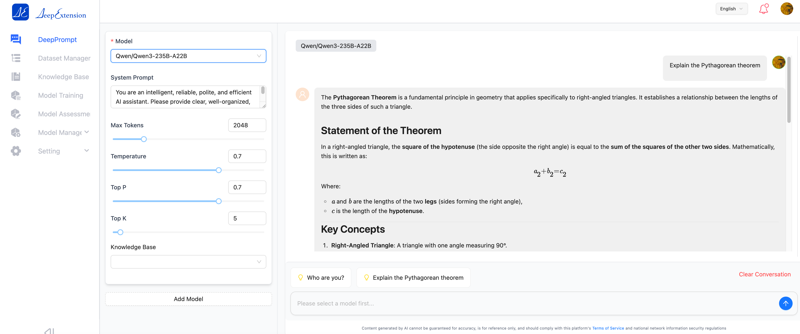

## 💡 1. What is DeepExtension?

[DeepExtension](https://deepextension.ai/) is an AI infrastructure platform that helps enterprises easily manage the full lifecycle of large language model (LLM) development — from data preparation to fine-tuning, evaluation, and deployment.

Our mission is to make domain-specific AI development **easy to use, highly collaborative, and scalable**, especially for teams lacking AI professionals or computing resources.

Whether you're an AI engineer or a business expert, DeepExtension provides a collaborative environment that leverages modern technologies like **PEFT**, **GRPO**, to help you build high-quality models — all through a modular web interface.

## 🎮 2. Official Documentation

Please visit [https://docs.deepextension.com](https://docs.deepextension.com) to view the official documentation.

## 🎉 3. Follow the Project

⭐️ Click the Star button in the top-right corner of the DeepExtension GitHub repo to get real-time updates on new releases! 🌟

## 🌟 4. Key Features

- 🤖 **Multi-model Chat & Knowledge Base Integration**: Communicate directly with locally trained models or various third-party models (from mainstream AI platforms), and combine them with personal or enterprise knowledge bases to enable intelligent Q&A and information retrieval.
- 🔌 **Easy Integration with Third-party Models & Platforms**: Quickly add and switch between various third-party models and platforms to meet diverse application needs.
- 🚀 **Local Model Training & One-click Deployment**: Support local fine-tuning and training of models; training results can be saved and deployed efficiently (e.g., in Ollama environments), greatly improving model iteration efficiency.
- 📚 **Quick Personal Knowledge Base Creation**: One-click to build a personal knowledge base; flexibly import files in various formats (e.g., PDF, DOCX, XLSX) for easy knowledge management and expansion.
- 📊 **Model Evaluation & Comparison**: Built-in model evaluation tools allow horizontal comparison across different models or versions, helping users select the most suitable target model.
- 📊 **Dataset Upload & Parsing**: Supports uploading and automatic parsing of datasets needed for model training, simplifying data preparation and accelerating development.

## 📚 5. Technical Documentation

This project is designed to offer an exceptionally user-friendly deployment and usage experience. It supports quick deployment on major operating systems like Linux, macOS, and Windows. By using Docker and Docker Compose, it significantly reduces environment setup complexity and dependency conflicts — enabling both individual developers and enterprise teams to get started quickly.

> **Note:** When deploying on macOS, Python-based training does not require image packaging. Please ensure dependencies like `pm2` are installed properly. See [Installation Guide](http://192.168.10.222:8080/zh/developer/install/) for details.

- [Installation Guide](http://192.168.10.222:8080/zh/developer/install/)
- [Frequently Asked Questions](http://192.168.10.222:8080/zh/faq/)

---

## 🏄 6. Open Source Community

- **Documentation Portal**: [DeepExtension Docs](http://192.168.10.222:8080/zh/)
- **Community Forum**: Coming soon — join discussions and submit feedback or feature requests
- **GitHub**: Track releases, submit issues, and contribute to our open-source components: [https://github.com/deepextension](https://github.com/deepextension)

## 🙌 7. Technical Support

If you encounter issues while using DeepExtension:

1. First consult the documentation and FAQ.
2. If the issue persists, contact **support@deepextension.ai** and include the following:
   - DeepExtension version number
   - Your operating system/environment
   - Detailed error messages or screenshots (if applicable)

We will respond within **two business days**.

## 🤝 8. Contact Us

For general inquiries, partnerships, or media requests, please reach out via:

- Email: **contact@deepextension.ai**
- Official Website: [https://www.deepextension.ai](https://www.deepextension.ai)

---

## 👥 9. Feedback & Feature Suggestions

We highly value your feedback! Let us know:

- What features are working well
- Any issues or bugs you’ve found
- What features you’d like to see in the future

Feedback channels:

- Email: **contact@deepextension.ai**
- GitHub Issues (for technical suggestions)

