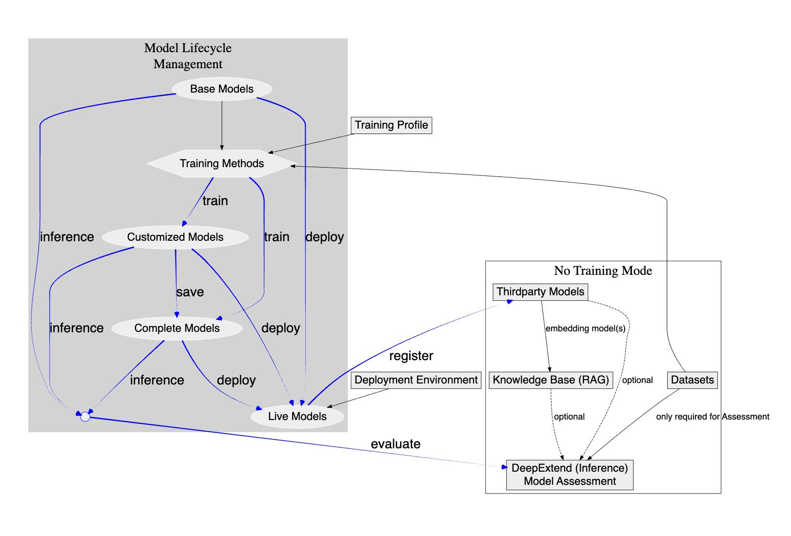

# Process Overview

This guide provides a concise explanation of the connections between various modules in **DeepExtension**. It answers a key question: What do I need to prepare before starting training, performing inference, or conducting an assessment?

---

## How to Interpret the Diagram Below

The arrows represent the following:

*   **Black Solid Arrow**: Indicates a mandatory prerequisite. The preceding step must be completed before the subsequent step can begin.
*   **Black Dashed Arrow**: Indicates an optional connection. This step is helpful but not strictly required.
*   **Blue Arrow**: Indicates a process that generates a new model state (e.g., Training or Saving). These represent part of the model lifecycle rather than strict dependencies.

---

## How to Start Your First Model Training

You will need:

*   A **Base Model** (see [Base Models](../user-guide/base-models.md))
*   A **Dataset** (see [Dataset Management](../user-guide/dataset-management.md))

The system comes with several built-in training methods ready for use.

➡️ Once everything is prepared, please refer to the tutorial:
[Quick Start: Run Your First Training](tutorial-quick-start.md)

---

## How to Start Prompt Inference (Trying out prompts with a model)

To perform prompt inference using **DeepExtend**, you need a model. Possible sources include:

*   A newly trained model
*   A saved Complete Model from a previous training session
*   A Third-party Model

Attaching a **Knowledge Base** (RAG) is optional.
Refer to [DeepText](../user-guide/deep-prompt.md) or [DeepImage](../user-guide/deep-image.md) and [RAG](../user-guide/document-embedding.md).

---

## How to Start Model Evaluation

Use the **Model Assessment** module to compare two models or test the output quality of a model.

You need to prepare:

*   One or more models (trained models or third-party models)
*   A dataset (used to generate evaluation questions)

For details, see [Model Assessment](../user-guide/model-assessment.md)

---

## What if I installed in "Training-Free Mode"?

Some users may have installed DeepExtension in **Training-Free Mode**.
This is suitable for scenarios such as:

*   RAG-based applications
*   Building knowledge bases
*   Testing third-party models

In this case, you can only use the processes covered in the **right-hand section** of the diagram.
(You cannot run training, save models, or deploy models.)

For a detailed explanation, please refer to the [Installation Guide](../developer/install.md)

---

## Model Lifecycle Management

If you have installed the full version, you can use the **Model Lifecycle Management** feature to manage base models and customized models throughout their entire lifecycle.

### **Lifecycle Path Overview**

The base model supports the following six main lifecycle paths:

1.  Base Model → Customized Model
2.  Base Model → Customized Model → Live Model
3.  Base Model → Customized Model → Live Model
4.  Base Model → Customized Model → Complete Model → Live Model
5.  Base Model → Complete Model
6.  Base Model → Complete Model → Live Model

### **Key Operations Explanation**

*   **Train**
    Train a specific base model using a designated dataset to generate a corresponding **Customized Model**.

*   **Assess**
    Use the **DeepExtend** tool or the **Model Assessment** function to perform real-time or batch evaluation of a **Customized Model**.

*   **Save**
    Convert an assessed **Customized Model** into an independent, reusable **Complete Model**.

*   **Deploy**
    Deploy a **Complete Model** as an **Online Model** available for production inference.

*   **Register**
    Register a deployed model as a reusable resource within the system, making it accessible similarly to a third-party model.

---

This flowchart helps you quickly understand your current stage and determine what to do next.