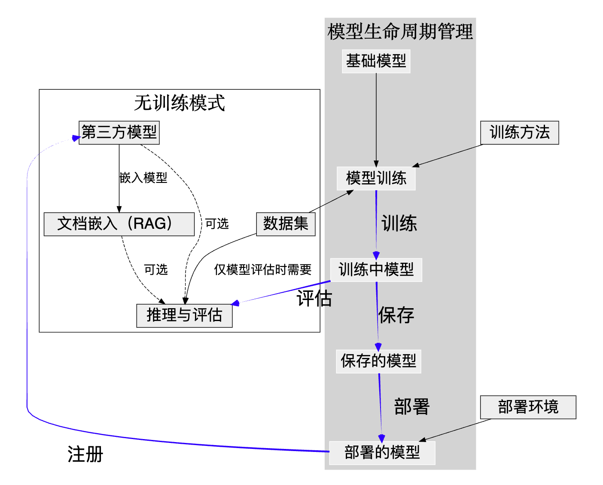

# 流程总览

本指南将为你简要说明 **DeepExtension** 中各个模块之间的连接关系。  它回答的一个关键问题是在开始训练、执行推理或进行评估之前，我需要准备什么？

---

## 如何理解下图

箭头的含义如下：

- **黑色实线箭头** 表示在进行后续步骤前，必须先完成该步骤。
- **黑色虚线箭头** 表示可选连接，有帮助但不是必需的步骤。
- **蓝色箭头** 表示一个过程将生成新的模型状态（例如训练或保存）。  
  这些不是严格的依赖，而是模型生命周期的一部分。

---

## 如何开始第一次模型训练

你需要：

- 一个 **基础模型**（见 [基础模型](../user-guide/base-models.zh.md)）
- 一个 **数据集**（见 [数据集管理](../user-guide/dataset-management.zh.md)）

系统中已内置了一些训练方法供调用。

➡️ 一切准备就绪后，请参考教程：  
[快速开始：运行你的第一次训练](tutorial-quick-start.zh.md)

---

## 如何开始提示推理（尝试使用模型运行提示）

若要使用 **DeepPrompt** 执行提示推理，需要一个模型，其来源可以是：

- 刚训练完成的模型
- 第三方模型

也可以附加一个 **知识库**（RAG），这是可选项。  
参考 [DeepPrompt](../user-guide/deep-prompt.zh.md) 与 [文档嵌入](../user-guide/document-embedding.zh.md)

---

## 如何开始模型评估

若要对两个模型进行对比，或测试模型的输出质量，请使用 **模型评估** 模块。

你需要准备：

- 一个或多个模型（训练模型或第三方模型）
- 一个数据集（用于生成评估问题）

详情见 [模型评估](../user-guide/model-assessment.zh.md)

---

## 如果我是以“无训练模式”安装的怎么办？

某些用户可能以 **无训练能力模式** 安装了 DeepExtension。  
适合以下场景：

- RAG 类型应用
- 构建知识库
- 测试第三方模型

在这种情况下，你只能使用图中 **左侧区域** 所涵盖的流程。  
（你无法运行训练，也无法保存或部署模型。）

详细说明请参考 [安装指南](../developer/install.zh.md)

---

## 模型生命周期（右侧区域）

如果安装的是完整版本，则可以使用 **模型生命周期管理流程**：

- 训练（Train）→ 从基础模型和数据集出发 → 创建一个 **定制模型**
- 评估（Assess）→ 使用 **DeepPrompt** 或 **模型评估** 对 **定制模型** 进行实时或批量评估
- 保存（Save）→ 将定制模型转化为独立的 **完整模型**
- 部署（Deploy）→ 将完整模型部署为可用于实时推理的 **上线模型**
- 注册（Register）→ 将部署后的模型注册为类似于第三方模型的可复用资源

这些都对应图中的蓝色箭头。

---

这张流程图能帮助你快速理解你现在在哪个阶段以及下一步该做什么。